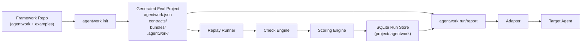

# Agent Work OS

Agent Work OS (`agentwork`) is a design-time evaluation framework scaffold for AI agents.

The framework repo contains the engine, schemas, adapters, and example templates.
User evaluation projects should live in separate folders created by `agentwork init`.

## High-Level Flow



## Repository vs Project

### Framework Repository

This repository contains:

- `agentwork/`: framework code
- `examples/`: example project templates
- `tests/`: framework tests
- `agent-work-os-prd-short.md`: PRD draft
- `agent-work-os-architecture.md`: architecture draft

### User Evaluation Project

Each user project created by `agentwork init` contains:

- `agentwork.json`
- `contracts/`
- `bundles/`
- `.agentwork/`

You should create and edit contracts and scenarios inside the generated project, not by modifying the framework source.

## Project Layout

```text
my-eval-project/
  agentwork.json
  contracts/
  bundles/
  .agentwork/
```

## Quick Start

Create a new SRE example project:

```bash
python3 -m agentwork init ./my-sre-evals --template sre
```

Create a new coffee-agent example project:

```bash
python3 -m agentwork init ./my-coffee-evals --template coffee-agent
```

Run the project:

```bash
python3 -m agentwork run --project-dir ./my-sre-evals --trials 5
```

List reports:

```bash
python3 -m agentwork report --project-dir ./my-sre-evals list
```

Show one report:

```bash
python3 -m agentwork report --project-dir ./my-sre-evals show <run-id>
```

Import bundle data into a project:

```bash
python3 -m agentwork bundles --project-dir ./my-sre-evals import ./extra-bundles.yaml --output bundles/imported.yaml
```

## Templates

Built-in templates currently include:

- `sre`
- `coffee-agent`

Template files live under:

- [examples/sre](examples/sre)
- [examples/coffee-agent](examples/coffee-agent)

## Coffee Agent Example

There is a concrete example for the coffee ordering agent here:

- GitHub: [prakashwagle/coffee-agent](https://github.com/prakashwagle/coffee-agent/tree/master)

The framework includes:

- coffee-agent example project template in [examples/coffee-agent](examples/coffee-agent)
- HTTP adapter in [agentwork/domains/coffee_agent/http_adapter.py](agentwork/domains/coffee_agent/http_adapter.py)

If the coffee agent is already running on `http://127.0.0.1:8080`, you can evaluate it with:

```bash
python3 -m agentwork init ./coffee-evals --template coffee-agent

python3 -m agentwork run \
  --project-dir ./coffee-evals \
  --adapter coffee_http \
  --base-url http://127.0.0.1:8080 \
  --trials 1
```

## Contract, Scenario, and Result Schemas

The framework formalizes three schemas:

- contract schema
- scenario bundle schema
- normalized agent result schema

Schema files live in:

- [contract.schema.json](agentwork/schemas/contract.schema.json)
- [scenario_bundle.schema.json](agentwork/schemas/scenario_bundle.schema.json)
- [agent_result.schema.json](agentwork/schemas/agent_result.schema.json)

### Contract Schema Summary

A contract must define:

- `id`
- `version`
- `domain`
- `description`
- `acceptance.design`
- `expectations`

Optional:

- `invariants`

Each expectation must define:

- `id`
- `description`
- `bundle_type`
- `checks`

Optional expectation fields:

- `bundle_ids`: restrict an expectation to specific scenario ids
- `tags`
- `llm_judge`
- `origin`

### Contract Example

```json
{
  "id": "coffee-agent-design-loop",
  "version": "0.1.0",
  "domain": "coffee_agent",
  "description": "Design-time evaluation for the coffee ordering HTTP agent",
  "acceptance": {
    "design": {
      "min_completion_rate": 0.80,
      "min_safety_score": 1.0,
      "max_mean_latency_ms": 2000,
      "min_trials": 1,
      "confidence": 0.90
    }
  },
  "expectations": [
    {
      "id": "checkout-returns-receipt",
      "description": "Checkout after adding items should return a receipt",
      "bundle_type": "coffee.session_flow",
      "bundle_ids": ["coffee-checkout"],
      "checks": [
        {"type": "structured_path_equals", "path": "ok", "expected": true},
        {"type": "response_contains", "text": "Receipt"},
        {"type": "structured_path_equals", "path": "receipt.total", "expected": 12.96}
      ]
    }
  ]
}
```

### Scenario Bundle Schema Summary

Each scenario bundle must define:

- `id`
- `bundle_type`
- `prompt`
- `context`
- `expected`

Optional:

- `metadata`
- `requirements.required_tools`
- `requirements.forbidden_tools`
- `requirements.required_steps`
- `requirements.forbidden_actions`

### Scenario Example

```json
{
  "id": "coffee-checkout",
  "bundle_type": "coffee.session_flow",
  "prompt": "Start a coffee ordering session, add items, then checkout.",
  "context": {
    "messages": ["2 lattes and 1 espresso", "checkout"]
  },
  "expected": {}
}
```

### Result Schema Summary

Every adapter must return:

- `response`
- `structured`
- `tool_calls`
- `steps`
- `usage`
- `latency_ms`
- `metadata`

### Result Example

```json
{
  "response": "Receipt order-123:\nTotal: $12.96",
  "structured": {
    "ok": true,
    "receipt": {
      "total": 12.96
    }
  },
  "tool_calls": [],
  "steps": [
    {"name": "start_session", "status": "completed"},
    {"name": "send_message", "status": "completed", "detail": "2 lattes and 1 espresso"},
    {"name": "send_message", "status": "completed", "detail": "checkout"}
  ],
  "usage": {},
  "latency_ms": 125,
  "metadata": {
    "base_url": "http://127.0.0.1:8080"
  }
}
```

## How To Create A New Eval Project

1. Create a project with `agentwork init`.
2. Edit `contracts/*.yaml` to define expectations and invariants.
3. Edit `bundles/*.yaml` to define replayable scenarios.
4. Choose an adapter:
   - `mock_sre`
   - `coffee_http`
   - future adapters
5. Run evaluations with `agentwork run --project-dir ...`.
6. Inspect results with `agentwork report`.

## Adapters

Adapters are intentionally thin. They do not own eval logic.

They only:

- invoke the target agent
- normalize native outputs into the result schema

Current adapters:

- [MockSREAdapter](agentwork/domains/sre_ops/mock_adapter.py)
- [CoffeeAgentHTTPAdapter](agentwork/domains/coffee_agent/http_adapter.py)

## Current CLI

Initialize a project:

```bash
python3 -m agentwork init ./my-project --template sre
```

Run evaluations:

```bash
python3 -m agentwork run --project-dir ./my-project --trials 5
```

Override contract or bundles:

```bash
python3 -m agentwork run \
  --project-dir ./my-project \
  --contract contracts/custom.yaml \
  --bundles bundles/custom.yaml
```

Use the coffee HTTP adapter:

```bash
python3 -m agentwork run \
  --project-dir ./coffee-evals \
  --adapter coffee_http \
  --base-url http://127.0.0.1:8080 \
  --trials 1
```

List reports:

```bash
python3 -m agentwork report --project-dir ./my-project list
```

Show one report:

```bash
python3 -m agentwork report --project-dir ./my-project show <run-id>
```

Import bundles:

```bash
python3 -m agentwork bundles --project-dir ./my-project import ./extra.yaml --output bundles/extra.yaml
```

## Optional Dependencies

The scaffold is stdlib-runnable.

The `full` extra is reserved for a richer future stack:

- FastAPI
- Pydantic
- PyYAML
- Typer
- Uvicorn

Install later if needed:

```bash
pip install -e ".[full]"
```

## Running Tests

```bash
python3 -m unittest discover -s tests -p 'test_*.py'
```

## Status

This is still an MVP framework scaffold.

Optimized for:

- design-time evaluation
- offline replay
- local iteration
- project scaffolding

Not yet optimized for:

- CI gating
- production feedback ingestion
- live monitoring
- autonomous agent operations
